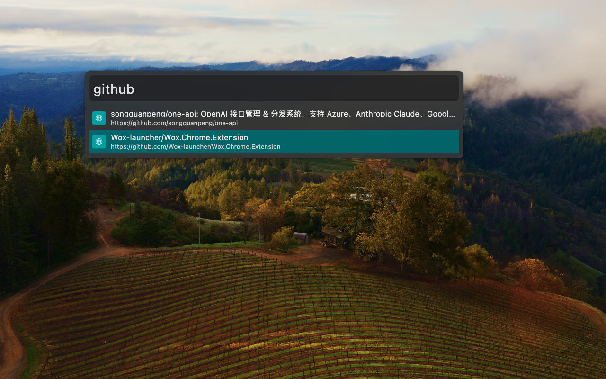

# Wox chrome extension

After install this chrome extension, you can search opened tabs and switch to it from Wox.

# Install

## 1. Chrome Extension Store

Waiting for review

## 2. Manual

1. Download from release and unzip it.
2. Open Chrome, go to `chrome://extensions/` and enable `Developer mode`.
3. Click `Load unpacked` and select the unzipped folder.
